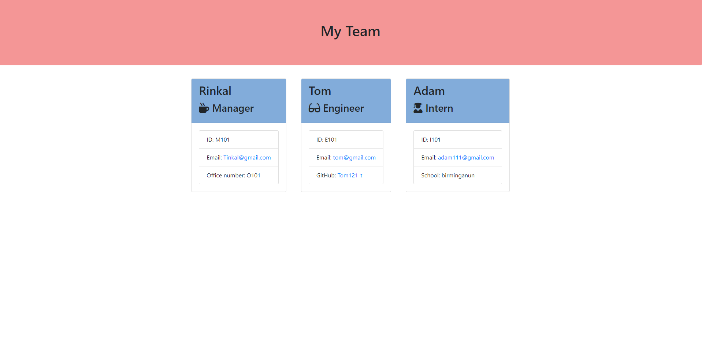

# Test-Driven Development: Team Profile Generator


## Description

The Test-Driven Development (TDD) Team Profile Generator is a project aimed at creating a command-line application for generating team profiles. This project follows the principles of Test-Driven Development, where tests are written before the code is implemented. The primary goal of this project is to ensure that the generated code is thoroughly tested and meets the requirements.
## Features

- **Team Profile Generation**: The application will allow users to create a team profile by adding team members with their details, such as name, role, ID, and specific information related to their role (e.g., manager's office number, engineer's GitHub username, intern's school).

- **Multiple Roles**: The application should support multiple roles, such as Manager, Engineer, and Intern. Each role will have unique information associated with it.

- **HTML Output**: The application will generate an HTML file that displays the team profile. Each team member's information will be formatted nicely in a visually appealing HTML template.

- **Testing Framework:**: The project will use a testing framework (e.g., Jest) to create and run tests for the application. Tests will be created before writing code to ensure the functionality works as expected.

- **Command-Line Interface (CLI)**: Users will interact with the application through a command-line interface. They can input the team members' details and generate the HTML profile.


## Technologies Used

**Node.js:** The application will be built using Node.js to handle the command-line interface and backend logic.

**Inquirer.js:** To prompt users for input and gather team member information.

**Jest (or other testing framework):** To create and run unit tests for the application.

**HTML and CSS:** For generating the HTML output and styling the team profile.


## Run Locally

Clone the project

```bash
  git clone https://link-to-project
```

Go to the project directory

```bash
  cd my-project
```

Install Dependencies:

```bash
  npm install
```

Run the Application:

```bash
  node index.js
```


## Screenshots




## Lessons Learned

During the development of this project, I learned the following:

1. **Importance of Test-Driven Development (TDD) :** You learned the benefits of writing tests before implementing code. TDD helped ensure that your application's functionality was thoroughly tested, which can save time and prevent bugs in the long run.

2. **Role-Based Data Handling :** Handling data for multiple roles (Manager, Engineer, Intern) required careful planning and coding. You learned the importance of designing data structures and functions to accommodate different role-specific information.

3. **Command-Line Interface (CLI) Design :** Designing a user-friendly CLI is crucial for a command-line application. You gained insights into how to structure command prompts and make the user experience smooth.

4. **HTML Generation and Templating :** Creating HTML files programmatically to display the team profile challenged you to work with templating and formatting. You might have learned about HTML generation libraries or techniques to enhance this process.


## Credits


- [Inquirer](https://www.npmjs.com/package/inquirer) - We used the Inquirer package to create the interactive command-line interface for this application.

- This project is inspired by the principles of Test-Driven Development (TDD).


## Demo

[Video link of Project](https://drive.google.com/file/d/1v1w97qBdToLks-T5zlW1x9i4NSDHqsVh/view)


## License

Please refer to the LICENSE in the repo.

